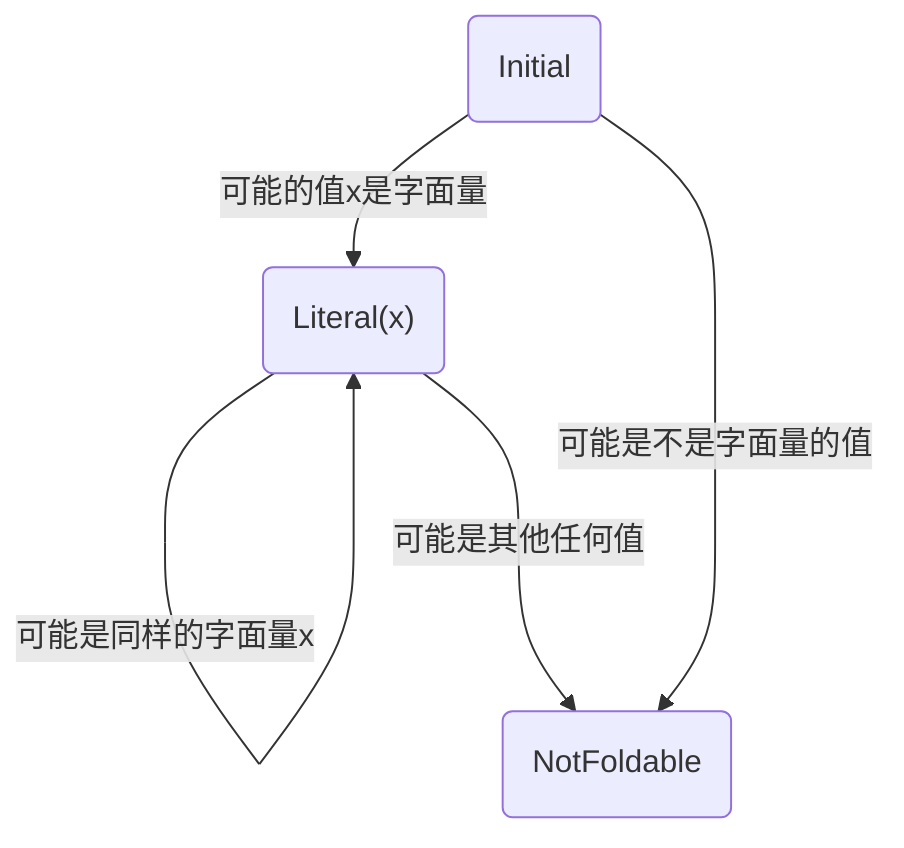
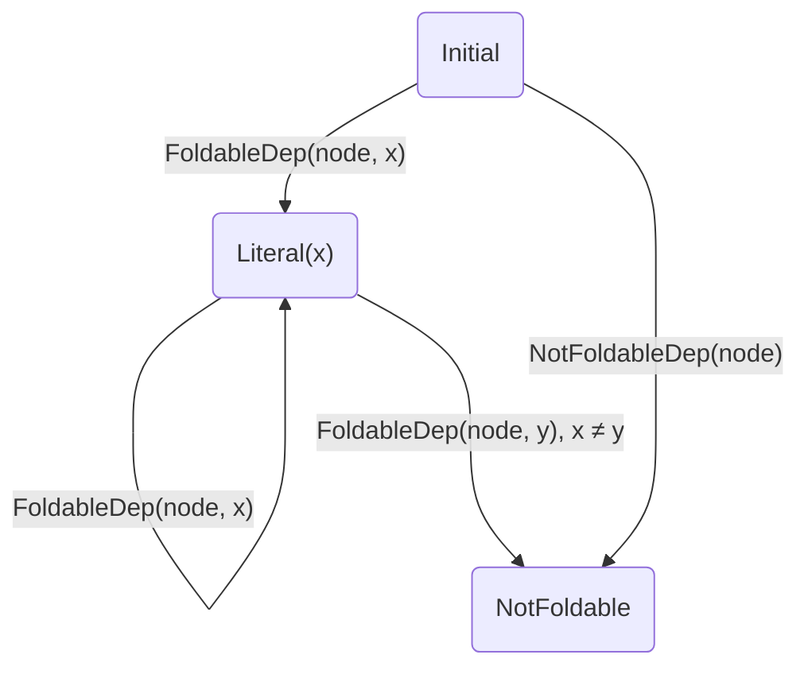

# Constant Folding

常量折叠是优化代码体积的常见手段。对于 JsShaker 来说，整个分析本身就需要对每个节点的在运行时可能出现的值进行分析，因此常量折叠更像是一个顺便实现的东西。JsShaker 的常量折叠比其他 js 优化器更加彻底。

## 背景

一种传统的常量折叠方法是反复地寻找操作数都是字面量的计算，然后将其计算结果替换掉原来的表达式，直至没有更多的字面量可以折叠为止。

这种方法的缺点：

1. 每次折叠都需要一次 AST 的遍历，效率较低
2. 并且在涉及函数调用传参时需要制定特别的规则来处理。而这些规则无法覆盖非常复杂的情况，比如动态的函数调用。因此无法实现最完整的常量折叠。
3. 其他优化，如死代码消除和常量折叠之间会相互作用，他们往往需要轮流调用。

## 基本理论

从根本上看，当一个节点在运行时只可能出现一种字面量值，就可以将其折叠为字面量值。而此处的“运行时”是指优化后的运行时，需要考虑死代码消除的影响。以下是一个例子：

```js
function f(value) {
  return pureCalc(value);
}
const a = f(1), b = f(2);
x = a;
```

只有在 `b` 作为无用代码被删除后，`f` 里的 `value` 才能折叠。比较理想的结果是：

```js
function f() {
  return pureCalc(1);
}
const a = f();
x = a;
```

> 这个问题在之前没有被考虑。后来进行了重写，修复了这一问题。

此外，计算结果为可折叠的字面量的表达式自身可能带有副作用。对此，有两种解决方案：

1. 若有副作用就不执行常量折叠
2. 执行常量折叠，但将副作用提取出来，放在一个 `SequenceExpression` 中。如 `(side_effect, collect_literal)`。

本文采用第二种方案。因为第一种方案会导致 JsShaker 的常量折叠极为复杂，而这种情况本身就极少见。

## 实现

该优化在 JsShaker 基本的分析框架下完成。

### 节点状态

通过一个简单的状态机来表示一个节点是否可以被折叠：



当分析完成后，如果一个节点的状态是 `Literal(x)`，那么它就可以被折叠为 `x`。否则，它就不能被折叠。

### 依赖

每当值流经一个节点，如果这个情况最终被保留（没有被删除），这个值就会影响这个节点是否可以被折叠。这恰恰契合 JsShaker 中值的依赖的概念。

- 如果值 `value` 是可以表示为字面量，则加带 `FoldableDep(node, value)` 的依赖
- 如果值 `value` 是不可以表示为字面量，则加带 `NotFoldableDep(node)` 的依赖

当这些依赖被消耗时，就会更新 `node` 的状态。上文的状态机相对于依赖的消耗可以表示为：



### 计算过程的删除

被折叠的节点，我们希望删除其计算过程需要的节点。比如：

```js
function f() {
// ^^^^^^^^^^^ A
  return   1   +   2;
// ^^^^^ B
}
x = f();
//  ^^^ C
```

优化时会删除整个 `f` 函数，得到 `x = 3`。

本文采取的方式是，当节点可以被折叠时，就不试图保留它的计算过程。比如对于 `f()` 节点，在分析时，其原本的值是 `Computed(3, { A, B, C })`，由于它可以被折叠，因此它的值就变成了：

`Computed(3, FoldableDep(node=C, value=Computed(3, { A, B, C })))`

此时，当它被赋值给 `x` 时，就会消耗掉 `FoldableDep(...)`，而非常规的 `{ A, B, C }`。这一操作根据上文所述，会将 `C` 节点的状态从 `Initial` 变为 `Literal(3)`；但不像之前的值那样会将 A, B, C 节点标记为需要保留。

### 计算过程的保留

有些节点，在初次分析时被认为可以被折叠，但在后续的分析中又被认为不可以被折叠。比如：

```js
function f(x) {
// ^^^^^^^^^^^^ A
  console.log(    x    );
// ^^^^^^^^^^ B   ^ C
}
f(    1    );
//    ^ D
f(    2    );
//    ^ E
```

在这个例子中，`f(1)` 执行完后我们认为节点 C 可以被折叠，而在 `f(2)` 执行完后，却发现并不行。此时我们应当保留 A, D, E 节点。

这样的保留操作，是在节点转换到不可折叠的状态时完成的。此前节点会收集所有被保留的可能的原始值（即上一节所说的原始的值）。而当它转换到不可折叠的状态时，就会将这些值消耗掉，以保留它们的计算过程。

### 其他

在 JsShaker 中，Constant folding 是 Object property mangling 的基础，因为后者是本质上是对字符串常量的 mangling。二者在实现上有一些耦合，此处不再赘述。
